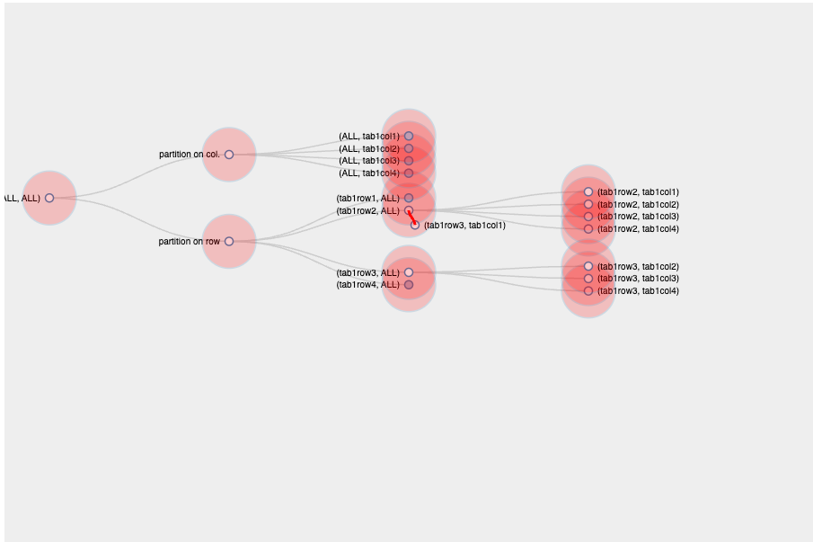

# d3-demos
Examples for D3 7.x

## Intro

[An introduction to d3.js](https://d3-graph-gallery.com/intro_d3js.html)

## Examples

### Sandbox Examples

[Sandbox Examples](https://codesandbox.io/examples/package/d3)

### Example 1

[Source Code](./1.html)

### Example 2

[Source Code](./2.html)

### Example 3

[Source Code](./3.html)

### Example 4

[Source Code](./4.html)

### Example 5

[Source Code](./demo/index.html)

### Example 6

[Source Code](./demo-2/README.md)

### Example 7

[Source Code](./demo-3/index.html)

## Reference

https://d3-graph-gallery.com/index.html

https://janmilosh.github.io/d3js-presentation/

<iframe src="https://codesandbox.io/embed/6p4s54?view=Editor+%2B+Preview&module=%2Fsrc%2FApp.js"
    style="width:100%; height: 500px; border:0; border-radius: 4px; overflow:hidden;"
    title="wonderful-haibt-6p4s54"
    allow="accelerometer; ambient-light-sensor; camera; encrypted-media; geolocation; gyroscope; hid; microphone; midi; payment; usb; vr; xr-spatial-tracking"
    sandbox="allow-forms allow-modals allow-popups allow-presentation allow-same-origin allow-scripts"
></iframe>

<iframe src="https://codesandbox.io/embed/5l95yk?view=Editor+%2B+Preview&module=%2Fsrc%2FApp.js"
    style="width:100%; height: 500px; border:0; border-radius: 4px; overflow:hidden;"
    title="d3-tree-react"
    allow="accelerometer; ambient-light-sensor; camera; encrypted-media; geolocation; gyroscope; hid; microphone; midi; payment; usb; vr; xr-spatial-tracking"
    sandbox="allow-forms allow-modals allow-popups allow-presentation allow-same-origin allow-scripts"
></iframe>

<iframe src="https://codesandbox.io/embed/5w8gxs?view=Editor+%2B+Preview&module=%2Fsrc%2FApp.tsx"
    style="width:100%; height: 500px; border:0; border-radius: 4px; overflow:hidden;"
    title="Tree rings"
    allow="accelerometer; ambient-light-sensor; camera; encrypted-media; geolocation; gyroscope; hid; microphone; midi; payment; usb; vr; xr-spatial-tracking"
    sandbox="allow-forms allow-modals allow-popups allow-presentation allow-same-origin allow-scripts"
></iframe>

<iframe src="https://codesandbox.io/p/devbox/github/tomliangg/binary-tree-visualizer/tree/main/?embed=1&file=%2Fdeploy.sh"
    style="width:100%; height: 500px; border:0; border-radius: 4px; overflow:hidden;"
    title="binary-tree-visualizer"
    allow="accelerometer; ambient-light-sensor; camera; encrypted-media; geolocation; gyroscope; hid; microphone; midi; payment; usb; vr; xr-spatial-tracking"
    sandbox="allow-forms allow-modals allow-popups allow-presentation allow-same-origin allow-scripts"
></iframe>

<iframe src="https://codesandbox.io/embed/8hlbv?view=Editor+%2B+Preview&module=%2Fsrc%2FApp.js"
    style="width:100%; height: 500px; border:0; border-radius: 4px; overflow:hidden;"
    title="D3-Tree"
    allow="accelerometer; ambient-light-sensor; camera; encrypted-media; geolocation; gyroscope; hid; microphone; midi; payment; usb; vr; xr-spatial-tracking"
    sandbox="allow-forms allow-modals allow-popups allow-presentation allow-same-origin allow-scripts"
></iframe>