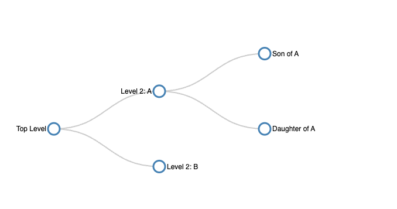
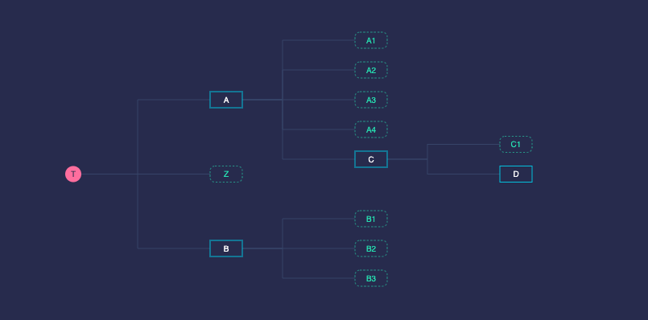
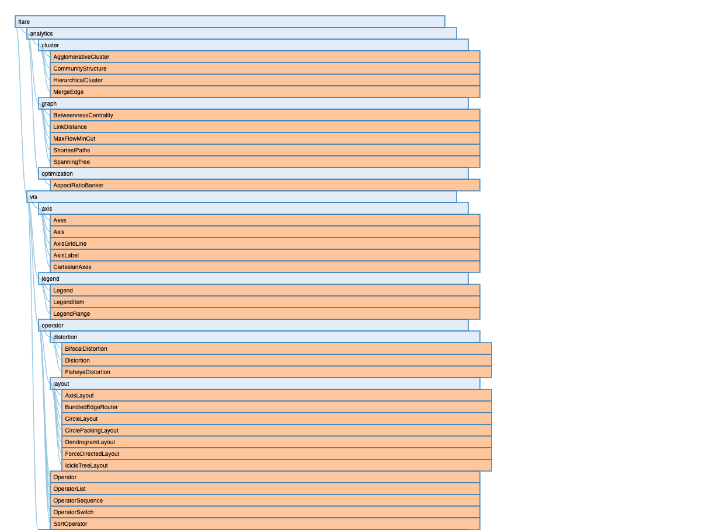
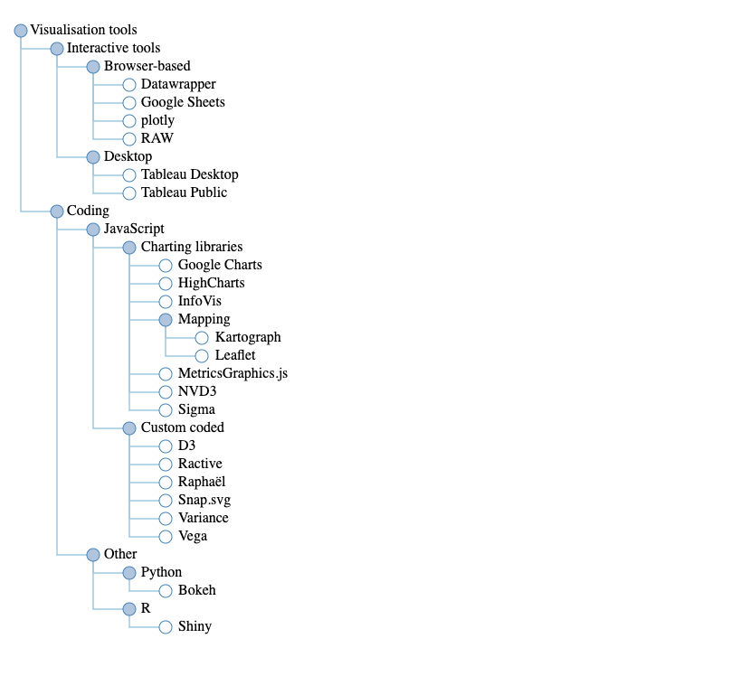
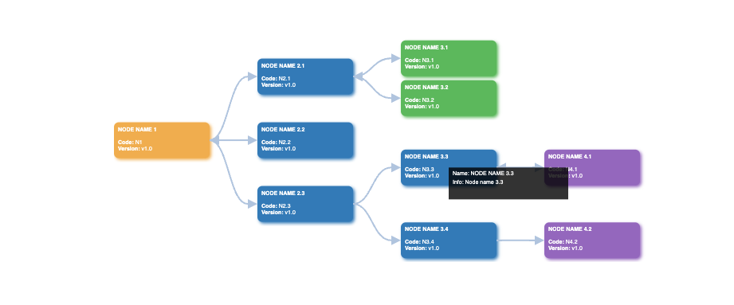
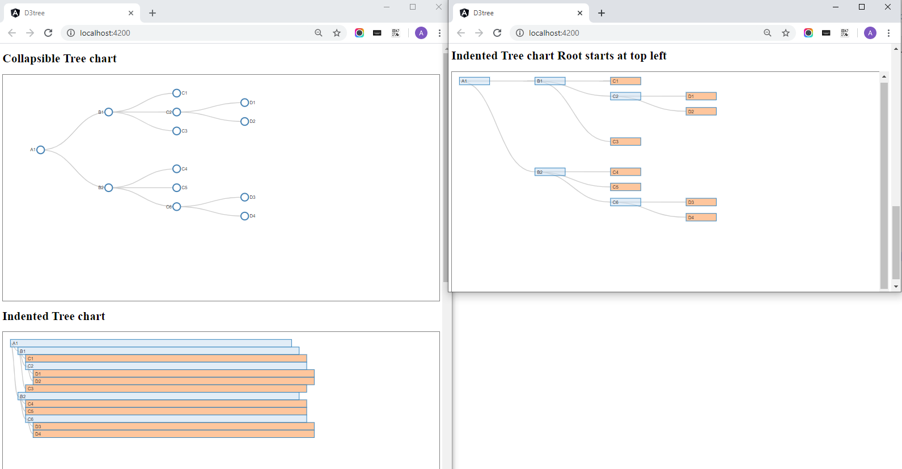

# d3-demos
Examples for D3 7.x

## Intro

[An introduction to d3.js](https://d3-graph-gallery.com/intro_d3js.html)

## Examples

### Sandbox Examples

[Sandbox Examples](https://codesandbox.io/examples/package/d3)

### Example 1

[Source Code](./1.html)

### Example 2

[Source Code](./2.html)

### Example 3

[Source Code](./3.html)

### Example 4

[Source Code](./4.html)

### Example 5

[Source Code](./demo/index.html)

### Example 6

[Source Code](./demo-2/README.md)

## Reference

https://d3-graph-gallery.com/index.html

https://janmilosh.github.io/d3js-presentation/